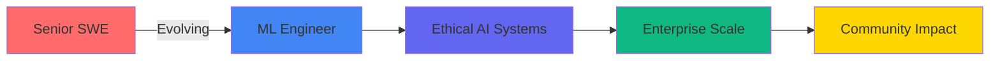

# ✨ Salaam! I'm Abdurahman

<div align="center">

```ascii
    ╔═══════════════════════════════════════════════════════════════╗
    ║                                                               ║
    ║   🌟  Senior Software Engineer → AI/ML Architect  🚀         ║
    ║                                                               ║
    ║   Where Neurodivergent Innovation Meets Ethical Technology   ║
    ║                                                               ║
    ╚═══════════════════════════════════════════════════════════════╝
```


**[@OpenText](https://opentext.com) | Hamilton, ON 🇨🇦 | Neurodivergent Innovator 🧠**

[](https://www.linkedin.com/in/abdurahman24/)
[](https://leetcode.com/u/poeticinspired/)
[](mailto:your.email@example.com)

</div>

---

## 🎭 The Plot Twist Developer

Most developers choose **one path**. I chose to walk between worlds.

<table>
<tr>
<td width="50%">

### 🏛️ **The Foundation**
```yaml
Past Life:
  degree: "Political Science, Criminology, Philosophy"
  gpa: 4.0
  university: "University of Windsor"
  skills_gained:
    - Systems thinking
    - Pattern recognition in chaos
    - Ethical frameworks
    - Human behavior analysis
```

</td>
<td width="50%">

### ⚡ **The Transformation**
```yaml
Current Reality:
  role: "Senior Software Engineer"
  company: "OpenText"
  gpa: 3.82
  graduation: 2025
  superpower: "Seeing code through human lenses"
  impact: "Where ethics meets execution"
```

</td>
</tr>
</table>

**The Secret Sauce?** My humanities background isn't a detour—it's my competitive advantage. I don't just build systems; I understand the humans they serve.

---

## 💥 Impact By The Numbers

<div align="center">

### When Code Meets Consequence

<table>
<tr>
<td align="center" width="25%">

<br/><b>Daily Transactions</b><br/>
<sub>Processing financial data at scale</sub>
</td>
<td align="center" width="25%">

<br/><b>Annual Savings</b><br/>
<sub>Through cloud migration strategy</sub>
</td>
<td align="center" width="25%">

<br/><b>API Latency Cut</b><br/>
<sub>Milliseconds matter at scale</sub>
</td>
<td align="center" width="25%">

<br/><b>Youth Mentored</b><br/>
<sub>Paying it forward</sub>
</td>
</tr>
</table>

</div>

---

## 🧰 The Toolkit

<div align="center">

### Languages That Tell Stories


### Frameworks That Scale


### AI/ML Arsenal


### Cloud Infrastructure


</div>

---

## 🚀 Projects That Moved The Needle

### 🔐 [SSH Attack Pattern Detection](https://github.com/poeticinspiired/SSH-Traffic-Clustering-Analysis)
> **The Problem:** Network security teams drowning in false positives  
> **The Solution:** ML-powered clustering analysis that separates signal from noise  
> **Tech Stack:** Python • Scapy • K-Means • Feature Engineering  
> **The Impact:** Transformed raw packet captures into actionable security intelligence

**Why This Matters:** In cybersecurity, context is everything. This isn't just clustering—it's teaching machines to think like security analysts.

---

### 📊 [Infrastructure Alert Dashboard](https://github.com/poeticinspiired/infrastructure-alert-dashboard)
> **The Problem:** DevOps teams losing hours to incident correlation  
> **The Solution:** Real-time monitoring dashboard with predictive analytics  
> **Tech Stack:** TypeScript • React • Kafka • Graph Algorithms  
> **The Impact:** Slashed MTTR through intelligent alert aggregation

**The Secret Weapon:** Graph-based relationship mapping that shows you the "why" behind the "what."

---

### 🤖 [LLM Training Data Pipeline](https://github.com/poeticinspiired/llm_data_pipeline)
> **The Problem:** Data quality is the bottleneck in AI development  
> **The Solution:** Cloud-native curation pipeline with quality scoring  
> **Tech Stack:** Python • MongoDB • AWS • Prefect • Data Deduplication  
> **The Impact:** Reproducible, enterprise-grade dataset management

**Philosophy Baked In:** Great AI starts with ethical data practices. This pipeline enforces quality at every stage.

---

## 📈 GitHub Activity Heatmap

<div align="center">


<table>
<tr>
<td width="50%">


</td>
<td width="50%">


</td>
</tr>
</table>


</div>

---

## 🎯 Current Mission: 2025 Edition

<div align="center">



</div>

### 🔬 Deep Diving Into:
- **Large Language Models** → Building responsible training pipelines
- **Real-time ML Systems** → Kafka + PyTorch in production
- **Cloud-Native AI** → Kubernetes-orchestrated model serving
- **Ethical AI Frameworks** → Because with great power...

### 🎪 Side Quests:
- Contributing to open-source ML tools
- Mentoring through community tech programs  
- Writing about the intersection of ethics and engineering
- Building bridges between technical and non-technical stakeholders

---

## 🧠 The Neurodivergent Advantage

<div align="center">

### Not a Bug. A Feature.

</div>

My neurodivergence isn't something I work *despite*—it's my **superpower**:

🔍 **Pattern Recognition** → I see connections others miss  
🌊 **Deep Focus States** → When I lock in, magic happens (usually 11 PM - 3 AM)  
🎯 **Systems Thinking** → Natural gift for architectural design  
💡 **Creative Problem-Solving** → The "weird" approach that actually works

**Real Talk:** The tech industry needs diverse minds. Different brains solve different problems. My journey from philosophy to production systems proves there's no "right" path to impact.

---

## 🏆 Trophy Case

<div align="center">

| Achievement | Details |
|-------------|---------|
| 🥇 **2× Hackathon Champion** | Built solutions that shipped |
| 📊 **Data Analyst Certified** | Google + IBM credentials |
| 🎓 **Dean's List** | Both degrees, consistently |
| 🌟 **Tech Community Co-founder** | 150% growth in digital engagement |
| 💼 **$1.5M Cost Optimization** | Real dollars, real impact |

</div>

---

## 🌟 Philosophy.md

```python
class Abdurahman:
    def __init__(self):
        self.belief = "Technology amplifies humanity—for better or worse"
        self.mission = "Build the 'better'"
        self.approach = "Ethics first, optimization second"
        
    def why_i_code(self):
        """
        Every system I build serves real humans.
        Every algorithm makes someone's life easier.
        Every optimization saves someone's time.
        
        Code without purpose is just syntax.
        """
        return "Building bridges, not walls"
    
    def core_values(self):
        return {
            "accessibility": "Tech should work for everyone",
            "transparency": "Black boxes breed distrust",
            "responsibility": "AI ethics isn't optional",
            "community": "We rise by lifting others"
        }
```

---

## 📬 Let's Build Something Together

<div align="center">

### Looking For:
🤝 **AI/ML Engineering Roles** where ethics meets execution  
🚀 **Collaborative Projects** pushing the boundaries of responsible AI  
💡 **Mentorship Opportunities** both as mentor and mentee  
🌍 **Impact-Driven Teams** solving problems that matter

### My Timezone:
🕐 **EST (Hamilton, ON)** | Peak creativity hours: 23:00 - 03:00

<br/>

[](https://www.linkedin.com/in/abdurahman24/)
[](mailto:your.email@example.com)
[](https://leetcode.com/u/poeticinspired/)

<br/>

---


<br/>


<br/>

**"In code, as in life, the most elegant solution is often the most human."**

</div>
